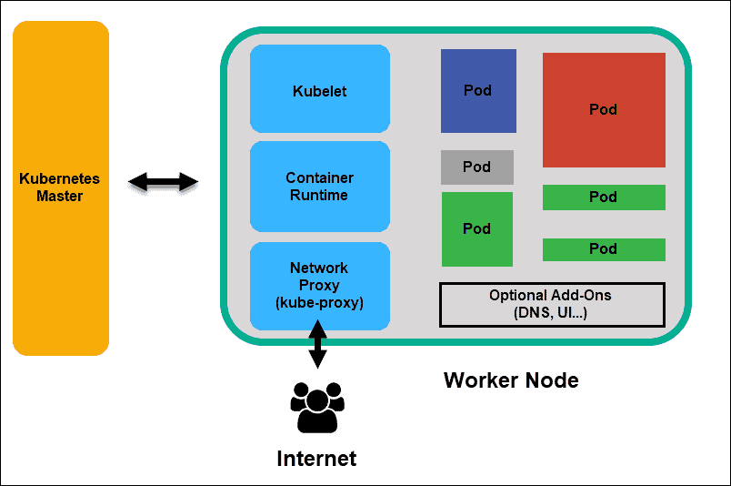

Estou inciando os estudos para KCA, sou uma pesoa onde preciso escrever para conseguir guardar mais os conteúdos. Com isso o material abaixo foi retirado de vários sites, os links estão na opção referências.

# Kubernetes

## Sumário

<!-- TOC -->
- [Kubernetes](#kubernets)
  - [Sumário](#sumário)
  - [o que é?](#o-que-é?)
  - [K8s](#k8s)
  - [Por que você precisa do K8s?](#por-que-você-precisa-do-k8s?)
  - [Arquitetura do K8s](#arquitetura-do-K8s)
    - [Componentes do cluster Kubernetes](#componentes-do-cluster-kubernetes)
        - [Master node](#master-node)
            - [API Server](#api-server)
            - [Key-Value Store (etcd)](#key-value-store-(etcd))
            - [Controller](#controller)
            - [Scheduler](#scheduler)
        - [Worker Node](#worker-node)
            - [Kubelet](#kubelet)
            - [Container Runtime](#container-runtime)
            - [Kube-proxy](#kube-proxy)
            - [Pod](#pod)
            - [Kubernetes services](#kubernetes-services)
                - [Como funcionam Kubernetes services](#como-funcionam-kubernetes-services)
  - [Instalação k8s](#instalação-k8s)
    - [Módulos](#módulos)
    - [Atualização do SO](#atualização-do-so)
    - [Instalando Docker](#instalando-docker)
    - [Instalação do k8s](#instalação-do-k8s)
    - [Iniciando cluster](#iniciando-cluster)
    - [Verificando o cluster](#verificando-o-cluster)
  - [Primeiros passos k8s](#primeiros-passos-k8s)
    - [Informações dos nós](#informações-dos-nós)
    - [Exibindo token para entrar no cluster](#exibindo-token-para-entrar-no-cluster)
    - [Namespaces](#namespaces)
        - [Visualizando namespaces](#visualizando-namespaces)
  - [Referências](#referências)

<!-- TOC -->

## O que é?

É um sistema de orquestração de containers open-source que automatiza a implantação, o dimensionamento e a gestão de aplicações em containêres. Ele foi projetado pelo Google onde teve seu código aberto em 2014, atualmente é mantido pela Cloud Native Computing Foundation.

## k8s

K8s é a abreviação derívada pela troca das oito letras "ubernete" por "8", se tornando k8s

## Por que você precisa do K8s?

Quando possuimos aplicações sendo executadas em contêineres é necessário gerencia-los para garantir que não exista tempo de inatividade. Por exemplo se um contêiner cair, outro contêiner precisa ser iniciado, o k8s te ajuda com isso.

O Kubernetes oferece uma estrutura para executar sistemas distribuidos de forma resiliente, ele cuida do escalonamento e da recuperação de falha e muito mais.

O K8s oferece a você:

- Descoberta de serviço e balanceamento de carga
- Orquestração de armazenamento
- Lançamento e reversões automatizadas
- Melhor distribuição de recursos
- Autocorreção
- Gerenciamento de configuração e segredos

## Arquitetura do K8s

Um cluster K8s é dividido em duas partes, o plano de controle e em um conjunto de máquinas de processamento, chamados nós que executam aplicações containerizadas. Todo cluster possui ao menos um servidor de processamento (worker node)

O design de um cluster Kubernetes é baseado em três princípios:

- Seguro: seguir as práticas recomendadas de segurança mais avançada
- Fácil de usar: alguns comandos são suficiente para opera-lo
- Extensível: ele não deve favorecer um fornecedor e precisa ser personalizável por meio de um arquivo de configuração

### Componentes do cluster Kubernetes

Estas etapas ilustram o processo básico do K8s

1 - Um administrador cria e coloca o estado desejado de um aplicativo em um arquivo de manifesto.
2 - O arquivo é fornecido ao servidor da API do K8s usando linha de comando ou UI. A ferramenta de linha de comando padrão do kubernetes é o kubectl
3 - O Kubernetes armazena o arquivo (o estado desejado de um aplicativo) em um banco de dados chamado Key-Value Store (etcd)
4 - O kubernetes então implementa o estado desejado em todos os aplicativos relevantes dentro do cluster
5 - O k8s monitora então continuamente os elementos do cluster para garantir que o estado atual do aplicativo não altere do estado desejado

|  |
|:---------------------------------------------------------------------------------------------:|
| *Arquitetura Kubernetes [Ref: phoenixnap.com KB article](https://phoenixnap.com/kb/understanding-kubernetes-architecture-diagrams)* 

### Master node

O master node recebe a entrada de uma CLI (interface de linha de comando) ou UI (interface de usuário) por meio de uma API. Você pode definir pods, conjuntos de réplicas e serviços que deseja que o kubernetes mantenha. Por exemplo, qual imagem de container usar, qual portas expor e quantas réplicas de pod executar.

|  |
|:---------------------------------------------------------------------------------------------:|
| *Master node [Ref: phoenixnap.com KB article](https://phoenixnap.com/kb/understanding-kubernetes-architecture-diagrams)* 

### API Server

A API do k8s é o front-end do plano de controle e o único componente que interagimos diretamente. Os componentes internos do sistema, bem como os componentes externos do usuário, comunicam-se por meio da mesma API.

### Key-Value Store (etcd)

O etcd é um banco de dados que o kubernetes usa para fazer backup de todos os dados do cluster. Ele armazena toda configuração e o estado do cluster. O master node consulta o etcd para recuperar parâmetros para o estado dos nós, pods e containers.

### Controller

O controller tem a função de obter o estado desejado da API server. Ele verifica o estado atual dos nós que tem a tarefa de controlar, determinar se há diferenças e as resolver, se houver.

### Scheduler

O scheduler monitora novas solicitações provenientes da API e as atribui a nós íntegros. Ele classifica a qualidade dos nós e implanta pods no nó mais adequado. Se não houver nós adequados, os pods serão colocados em um estado pendente até que esse nó apareça.

### Worker Node

Os Worker Node escutam o API server para novas atribuições de trabalho; eles executam as atribuições de trabalho, e em seguida relatam os resultados de volta ao master node.

|  |
|:---------------------------------------------------------------------------------------------:|
| *Worker Node [Ref: phoenixnap.com KB article](https://phoenixnap.com/kb/understanding-kubernetes-architecture-diagrams)* 

### Kubelet

O kubelet é executado em todos os nós do cluster, é o principal agente do kubernets. Ao instalar o kubelet, a CPU, RAM e armazenamento do nó tornan-se parte do cluster. Ele observa as tarefas enviadas da API, executa a tarefa e informa o master. Ele também monitora os pods e informa o painel de controle se um pod não estiver totalmente funcional. Com base nessas informações o master pode então decidir como alocar tarefas e recursos para atingir o estado desejado.

### Container Runtime

O container runtime extrai imagens de um container image registry e incia e interrompe os containers.

### Kube-proxy

O Kube-proxy garante que cada nó obtenha seu endereço de IP, implementa iptables local e regras para lidar com roteamento e balanceamento de carga de tráfego.

### Pod

Um pod é o menor elemento do kubernetes, sem ele um container não pode fazer parte de um cluster. Se você precisar dimensionar seu aplicativo, só poderá fazer isso adicionando ou removendo pods.

O pod serve como um "wrapper" para um único container com código do aplicativo. Com base na disponibilidade de recursos, o master programa o pod em um nó específico e coordena com o container runtime para iniciar o container

|  |
|:---------------------------------------------------------------------------------------------:|
| *Pod [Ref: phoenixnap.com KB article](https://phoenixnap.com/kb/understanding-kubernetes-architecture-diagrams)* 

Nos casos em que os pods falham inesperadamente ao realizar suas tarefas, o k8s não tenta corrigi-los. Em vez disso, ele cria e incia um novo pod em seu lugar. Esse novo pod é uma réplica, exceto para o DNS e o endereço de IP. Esse recurso teve um impcto profundo em como os desenvolvedores projetam aplicativos.

Devido à natureza flexível da arquitetura do kubernetes, os aplicativos não precisam mais estar vinculados a uma instância específica de um pod. Em vez disso, os aplicativos precisam ser projetados para que um pod interamente novo, criado em qualquer lugar dentro do cluster, possa perfeitamente tomar seu lugar. Para ajudar nesse processo, o kubernetes utiliza serviços.

## Kubernetes services

Os pods não são constantes, como falamos anteriormente. Um dos melhores recursos que o kubernetes oferece é que pods que não funcionam são substituídos por novos automaticamente.

No entanto, esse novos pods têm um conjunto diferente de IPs. Isso pode levar a problemas de processamento e rotatividade de IP, pois os IPs não correspondem mais. Se deixada sem supervisão, essa propriedade tornaria os pods altamentes não confiáveis.

Os serviços são introduzidos para fornecer rede confiável, trazendo endereços de IP e nomes DNS estáveis para o mundo instável dos pods.

Ao controlar o tráfego que entra e sai do pod, um serviço kubernetes fornece um ponto de extremidade de rede estável - um IP, DNS e porta fixos. Por meio de um serviço, qualquer pod pode ser adicionado ou removido sem o medo de que as informações básicas da rede mudem de alguma forma.

### Como funcionam Kubernetes services

Os pods são associados a serviços por meio de pares de valores chaves chamados label e selectors. Um serviço descobre automaticamente um novo pod com label que correspondem ao selector.

Esse processo adiciona perfeitamente novos pods ao serviço e, ao mesmo tempo, remove pods encerrando o cluster.

Por exemplo, se o estado desejado incluir três réplicas de um pod e um nó executando uma réplica falhar, o estado atual será reduzido para dois pods. kubernetes observa que o estado desejado são de três pods. Em seguida, ele agenda uma nova réplica para ocupar o lugar do pod com falha e a atribui a outro nó no cluster.

O mesmo se aplica ao atualizar ou dimensionar o aplicativo adicionando ou removendo pods. Depois de atualizar o estado desejado, o k8s percebe a discrepância e adiciona ou remove pods para corresponder ao arquivo de manifesto. O painel de controle do kubernetes registra, implementa e executa loops de reconciliação em segundo plano que verificam continuamente se o ambiente atende aos requisitos definidos pelo usuário.

## Instalação k8s

### Módulos

O k8s necessita de certos módulos do kernel GNU/Linux. Para isso crie o arquivo abaixo

    /etc/modules-load.d/k8s.conf

    br_netfilter
    ip_vs
    ip_vs_rr
    ip_vs_sh
    ip_vs_wrr
    nf_conntrack_ipv4

### Atualização do SO

Vamos utilizar Debian, segue comando para atualização

    sudo apt update

    sudo apt upgrade -y

### Instalando Docker

    sudo curl -fsSL https://get.docker.com | bash

os próximos comandos são muito importantes, pois garantem que o driver Cgroup do Docker será configurado para o systemd, que é o gerenciador de serviços padrão utilizado pelo Kubernetes.

    cat > /etc/docker/daemon.json <<EOF
    {
    "exec-opts": ["native.cgroupdriver=systemd"],
    "log-driver": "json-file",
    "log-opts": {
        "max-size": "100m"
    },
    "storage-driver": "overlay2"
    }
    EOF

    sudo mkdir -p /etc/systemd/system/docker.service.d

Agora basta reiniciar o Docker.

    sudo systemctl daemon-reload
    sudo systemctl restart docker

Para finalizar, verifique se o driver Cgroup foi corretamente definido.

    docker info | grep -i cgroup

A saída deve ser assim

    lucas@k8s-server01:~$ sudo docker info | grep -i cgroup
    Cgroup Driver: systemd
    Cgroup Version: 2
    cgroupns

### Instalação do k8s

Agora vamos efetuar a adição dos repositórios do k8s e efetuar a instalação do kubeadm

    sudo apt-get update && sudo apt-get install -y apt-transport-https gnupg2

    curl -s https://packages.cloud.google.com/apt/doc/apt-key.gpg | sudo apt-key add -

    sudo echo "deb http://apt.kubernetes.io/ kubernetes-xenial main" > /etc/apt/sources.list.d/kubernetes.list

    sudo apt-get update

    sudo apt-get install -y kubelet kubeadm kubectl

Devemos desativar memória swap

    sudo swapoff -a

Também devemos comentar a linha referênte a memória swap no /etc/fstab

### Iniciando cluster

Vamos realizar o download das imagens que serão utilizadas

    sudo kubeadm config images pull

Execute o comando abaixo apenas no nó master para inicialização do cluster. Na saída do comando ele deve mostrar qual comando usar nos demais nós do cluster

    sudo kubeadm init

Podemos utilizar a opção --apiserver-advertise-address informando qual IP em que o servidor API deve escutar. Quando este parâmetro não é passado, a interface de rede padrão é utilizada. Opcionalmente você também pode passar o cidr com a opção --pod-network-cidr. O comando ficará assim

    kubeadm init --apiserver-advertise-address 192.168.99.2 --pod-network-cidr 192.168.99.0/24

A saída do comando será algo do tipo

    [WARNING SystemVerification]: docker version is greater than the most recently validated version. Docker version: 18.05.0-ce. Max validated version: 17.03
    ...
    To start using your cluster, you need to run the following as a regular user:

    mkdir -p $HOME/.kube
    sudo cp -i /etc/kubernetes/admin.conf $HOME/.kube/config
    sudo chown $(id -u):$(id -g) $HOME/.kube/config
    ...
    kubeadm join --token 39c341.a3bc3c4dd49758d5 IP_DO_MASTER:6443 --discovery-token-ca-cert-hash sha256:37092
    ...

Caso o servidor possua mais de uma placa de rede, você pode verificar o IP interno do nó do seu cluster com o seguinte comando:

    kubectl describe node server02 | grep InternalIP

A saída será algo do tipo

    InternalIP:  192.168.0.212

Se o IP não for da rede escolhida, você pode ir até o arquivo abaixo e procurar por KUBELET_CONFIG_ARGS e adicionar no final a instrução --node-ip=

    /etc/systemd/system/kubelet.service.d/10-kubeadm.conf 

O trecho alterado irá ficar nesse estilo

    Environment="KUBELET_CONFIG_ARGS=--config=/var/lib/kubelet/config.yaml --node-ip=192.168.99.2"

Salve o arquivo e execute os comandos abaixo para reiniciar as configurações e consequentemente o kubelet

    sudo systemctl daemon-reload
    sudo systemctl restart kubelet

### Verificando o cluster

Para verificar se a instalação está funcionando, e se os nós estão se comunicando, você pode executar o seguinte comando

    kubectl get nodes

## Primeiros passos k8s

### Informações dos nós

    kubectl describe node [nome_do_no]

### Exibindo token para entrar no cluster

Para visualizar novamente o token para adicionar novos nós 

    sudo kubeadm token create --print-join-command

### Namespaces

Os namespaces são uma maneira de organizar clusters em subclusters virtuais. Eles podem ser úteis quando diferentes equipes ou projetos compartilham um cluster do Kubernetes. Qualquer número de namespaces é suportado em um cluster, cada um logicamente separado dos outros, mas com a capacidade de se comunicarem uns com os outros.

Quando se deve usar vários namespaces do Kubernetes?

Pequenas equipes ou organizações menores podem ficar perfeitamente satisfeitas usando o namespace padrão. Isso é particularmente relevante se não houver necessidade de isolar desenvolvedores ou usuários uns dos outros. No entanto, existem muitos benefícios úteis em ter vários namespaces, incluindo:

- Isolamento: Equipes grandes ou em crescimento podem usar namespaces para isolar seus projetos e microsserviços uns dos outros. As equipes podem reutilizar os mesmos nomes de recursos em diferentes áreas de trabalho sem problemas. Além disso, executar uma ação em itens em uma área de trabalho nunca afeta outras áreas de trabalho.

- Organização: As organizações que usam um único cluster para desenvolvimento, teste e produção podem usar namespaces para ambientes de teste e desenvolvimento. Isso garante que o código de produção não seja afetado por alterações que os desenvolvedores ou testadores fazem em seus próprios namespaces durante o ciclo de vida do aplicativo.

- Permissões: Os namespaces permitem o uso do RBAC do Kubernetes, para que as equipes possam definir funções que agrupam listas de permissões ou habilidades sob um único nome. Isso pode garantir que apenas usuários autorizados tenham acesso aos recursos em um determinado namespace.

- Controle de recursos: Os limites de recursos orientados por política podem ser definidos em namespaces definindo cotas de recursos para utilização de CPU ou memória. Isso pode garantir que cada projeto ou namespace tenha os recursos de que precisa para ser executado e que nenhum namespace monopolize todos os recursos disponíveis.

- Atuação: O uso de namespaces pode ajudar a melhorar o desempenho de um determinado cluster. Se um cluster for separado em vários namespaces para projetos diferentes, a API Kubernetes terá menos itens para pesquisar durante a execução de operações. Isso pode reduzir a latência e acelerar o desempenho geral do aplicativo para cada aplicativo em execução no cluster.

Como os pods podem se comunicar entre os namespaces do Kubernetes?

Embora os namespaces sejam separados uns dos outros, eles podem se comunicar facilmente entre si. O diretório de serviço DNS do Kubernetes pode localizar facilmente qualquer serviço pelo nome usando a forma expandida de endereçamento DNS:

<Nome do serviço>. <Nome do namespace> .svc.cluster.local

Simplesmente adicionar o nome do namespace ao nome do serviço fornece acesso aos serviços em qualquer namespace no cluster. Por exemplo, para acessar o serviço de folha de pagamento no namespace de desenvolvimento, você usaria o endereço

folha de pagamento.desenvolvimento

Para acessar o serviço de folha de pagamento no namespace de produção, você usaria:

folha de pagamento.produção

Observe que as políticas de rede podem ser utilizadas opcionalmente para controlar o acesso entre namespaces. Por exemplo, uma política de rede pode permitir ou negar todo o tráfego de outros namespaces. As políticas de rede se aplicam apenas a conexões e não substituem os firewalls que executam a inspeção de pacotes.

#### Visualizando namespaces

Você pode listar os namespaces através do comando

    kubectl get namespaces

O K8s começa com 4 namespaces iniciais

- default : o namespace padrão para objetos sem outro namespace

- kube-system : o namespace para objetos criados pelo sistema Kubernetes

- kube-public : Este namespace é criado automaticamente e pode ser lido por todos os usuários (incluindo aqueles não autenticados). Este namespace é principalmente reservado para uso do cluster, no caso de alguns recursos ficarem visíveis e legíveis publicamente em todo o cluster. O aspecto público deste namespace é apenas uma convenção, não um requisito.

- kube-node-lease : Este namespace contém objetos Lease associados a cada nó. As concessões de nó permitem que o kubelet envie pulsações para que o plano de controle possa detectar a falha do nó

Vamos listar os pods do namespace kube-system através do comando

    kubectl get pod -n kube-system

É possível listar todos os pods de todos os namespaces com o comando a seguir.

    kubectl get pods --all-namespaces

Há a possibilidade ainda, de utilizar o comando com a opção -o wide, que disponibiliza maiores informações sobre o recurso, inclusive em qual nó o pod está sendo executado. Exemplo:

    kubectl get pods --all-namespaces -o wide

## Referências

    https://kubernetes.io/pt-br/docs/home/
    https://www.redhat.com/pt-br/topics/containers/kubernetes-architecture
    https://phoenixnap.com/kb/understanding-kubernetes-architecture-diagrams
    https://www.vmware.com/topics/glossary/content/kubernetes-namespace
